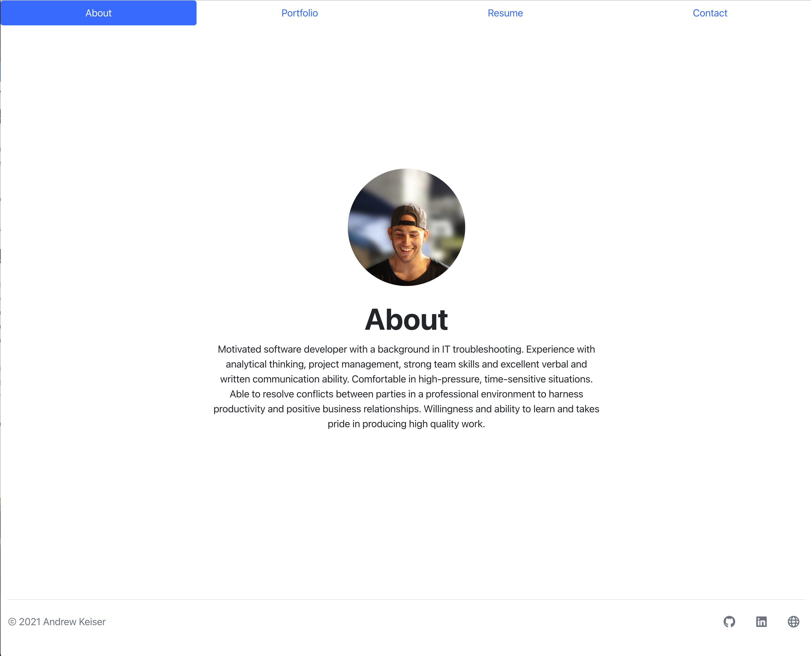
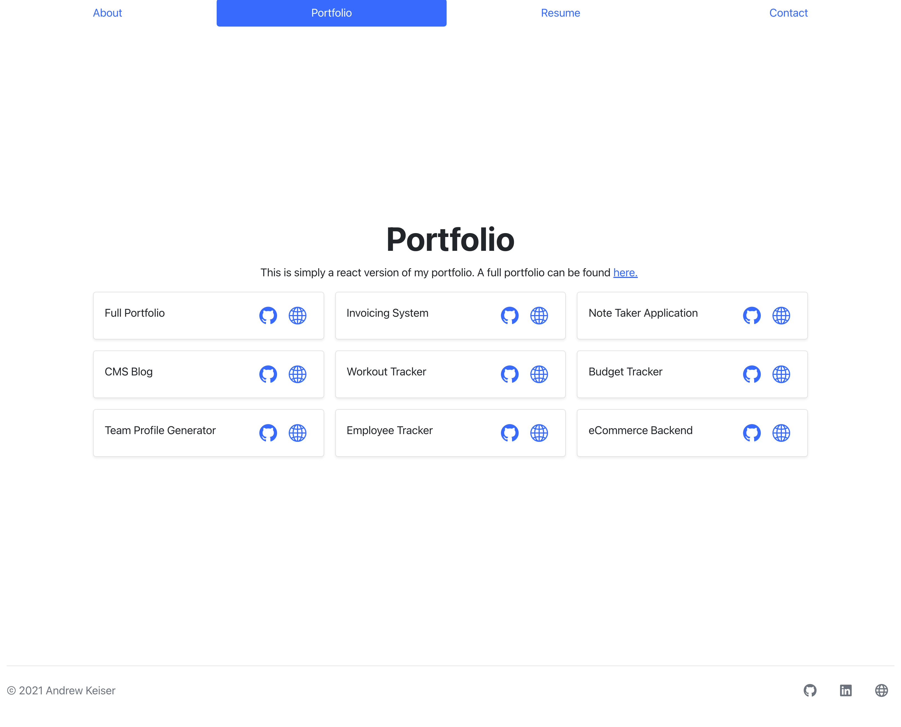
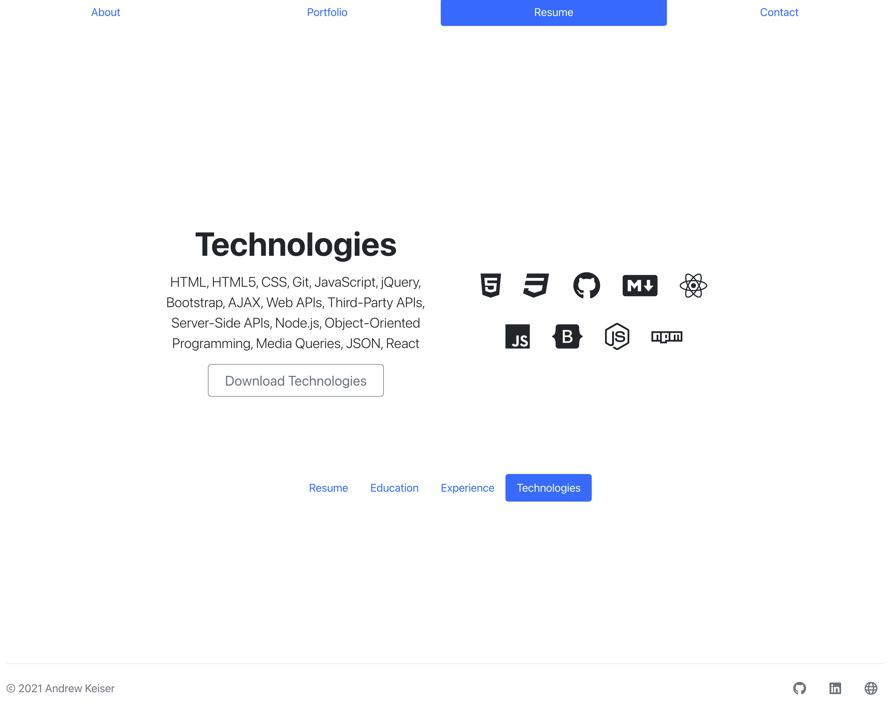
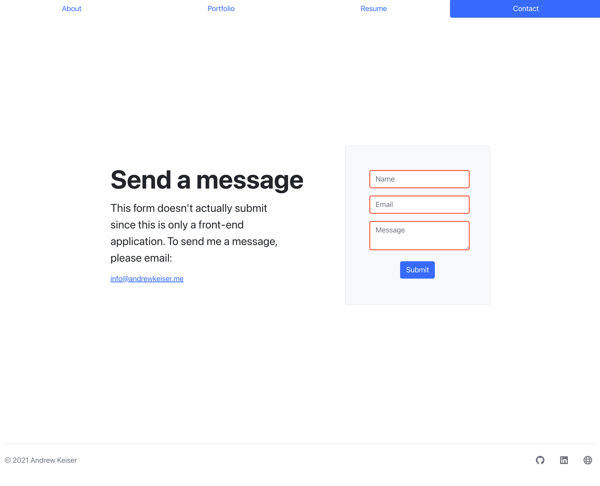

# React Portfolio

## Description

This is a react version of my portfolio to show competency in using React. 

## Links

[My GitHub](https://github.com/webdev410)

[Repo](https://github.com/webdev410/react-portfolio)

[Deployed](https://webdev410.github.io/react-portfolio)

For questions, please email webdev410@gmail.com

## Technologies

* [Node.JS](https://nodejs.org/en/docs/)
* [ReactJS](https://reactjs.org/)

## Screenshots

